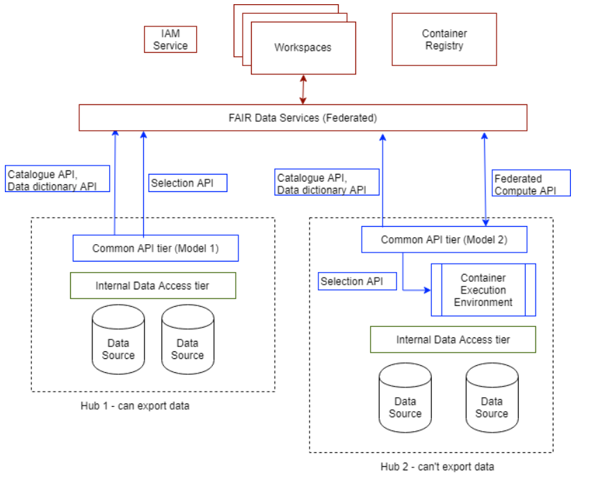

# Origins - Federated Data Sharing Common API

> Back to the main [README](../README.md)

## Introduction

This API originated in a strawman implementation of a federated data sharing API for an international collaboration on data sharing and federated compute.  It began with support for a project focused on Alzheimer's and other dementias, [launched in November 2020](https://www.alzheimersdata.org/news/addi-press-release) as the [Alzheimers Disease Data Initiative (ADDI)](https://www.alzheimersdata.org). The objective here was to be able to analyse data in a consistent way, even if some of the of interest could not travel from a data repository. The successful [pilot](https://www.alzheimersdata.org/ad-workbench/pilot-phase) brought together leading groups in the AD research community including [Dementias Platform UK](https://www.dementiasplatform.uk/) and their databank at [UKSerp, Swansea University](https://serp.ac.uk/serp-uk/), [Critical Path Institute](https://c-path.org/) and [GAAIN](http://www.gaain.org/) working with technical partners including [Aridhia Informatics](https://www.aridhia.com).

Since the initial pilot, the API has also been picked up for use by the [International COVID-19 Data Alliance](https://icoda-research.org/) as it builds out it's initiative and is under also investigation for usage by [Health Data Research UK](https://www.hdruk.ac.uk/) as both look to increase data usage and sharing in a controlled fashion, supporting the [UK ONS five safes model](https://blog.ons.gov.uk/2017/01/27/the-five-safes-data-privacy-at-ons/). We expect the API to evolve rapidly throughout 2021 as it's usage scales across these initiatives and we warmly welcome new collaborators & participants.

This document summarises the approach that led to the Common API.

> Please [get in touch](mailto:info@fds-api.org) if you would like to learn more and participate in this effort.

## Approach

Imagine a narrative for a research user who needs to access data from multiple data repositories, each with their own systems and processes. What is their user experience flow, how is that supported by underlying APIs provided by data platforms? Could that situation be improved through a Common API?

For the implementation it should not be too important what their study is about - it might impact researcher accreditation and the type of UX we might want to provide for selection & filtering but not for the generic, Common API. 

The ecosystem is diverse. Different participating data platforms can support different levels of data sharing. Ultimately the default level of sharing is a property of the *dataset* not the data platform or the hub.

### Levels of Sharing

The system envisages a network of nodes (data nodes, data provider platforms/data platforms) that participate in data sharing at different levels. Architecturally above the nodes sites another network of nodes (hubs) that form a collaboraiton network. In the simplest model, a single hub is a gateway to one or more data nodes. In the real world, multiple hubs are required to deal with legal boundaries for data hosting of healthcare data.

This results in different levels of sharing that coexist. 

- Level 0: Data hosted in hubs, can be found by metadata, and can be shared directly then linked and analysed at the user's hub (may need to be de-identified) 
- Level 1: Data hosted in data nodes, and can be selected from, then linked and analysed in the user's hub
- Level 2: Data hosted in data nodes, and can be computed on at source then derived data is shared and analysed in the user's hub

## Overview/Architecture

With this project, an organisation can deploy a prototype instance of the Common API as a Docker container and participate as a 'node' in a network of federated data sharing. Below is the original sketch architecture, in the context of adding federated data sharing to Aridhia's Workspace as part of a collaboration project:

A client system communicates with nodes using secure web connections and can implement whatever user workflow makes sense for user case.Endpoints are only provided over HTTPS. Calls to bare HTTP are redirect to HTTPS by the node. Nodes must use valid certificates.

Users or more generally, clients, are authorised using the OAuth2 system - it's up to the implementation what identity providers it accepts. Authentication and Authorisation is not role-based in the current prototype so all API end points are accessible. In some cases, the node may return a 'Not Implemented' error (HTTP code 501) if the end point is not supported. 

Nodes can store data as they wish. In the prototype implementation, files are used. Either the embedded 'data' folder is used or an external folder can be mounted on the container, allowing a separate files ystem to be used. Nodes can implement their own storage layer by adapting the prototype server or completely re-implementing the server using technologies of choice.

The API supports finding data, selecting and computing on data. All nodes must support the catalogue and dictionary APIs ('/dataset'), and can support a subset of the selection end points ('/selection'). For example, nodes could support the beacon or sample select endpoints, but not the endpoints that would return data (e.g. '/selection/select'). In this case they should (but are not obliged to) implement the federated compute API. Specifically, if a node does *not* support the select endpoints and they support the federated compute endpoints, the user can assume that the selection API is provided to specification in a container context. This means that the same selection would work whether the user was selecting the data remotely and computing over it remotely, or they submitted a compute job to be run locally near the data.